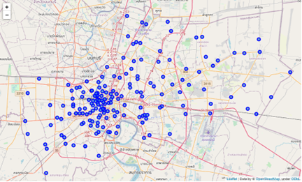
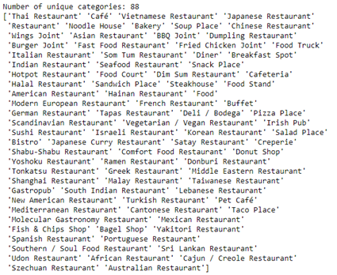
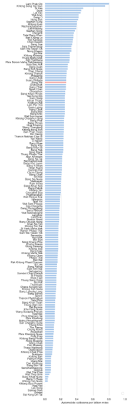
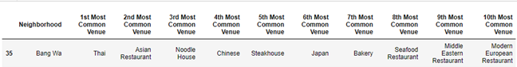
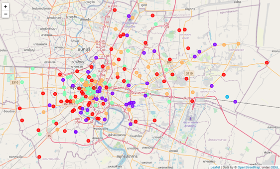

# IBM-Data-Science-Professional-Certificate-Capstone-Project

## 1) Introduction  
###  1.1) Background  
   Thailand is a paradise for tourism that is popular with people from all over the world. One of the key factors is the diversity of food and the culture of eating. Thai cooking places emphasis on lightly prepared dishes with strong aromatic components and a spicy edge. And there are also many nationalities of food in Thailand such as Japan, Korea, Europe, Asia, the Middle East.  

###  1.2) Business Problem   
   Longyang is a name of Thai restaurant that is mean “Have you tried?”. It is a restaurant that sells Thai and Chinese food. At present, the second generation of heirs is inheriting the business. The owners are deciding to expand their food sales category between Japan and Traditional Thai food, which will open next to the original store at Bang Wa district.  She is working on various factors that help make decisions, and one of them is a competition in the neighborhood. In additional, it is also a good idea to look for another location that will open new restaurants in the future in the new area.  
   To address this business problem, research will be done using data science methodology and machine learning techniques such as clustering to find the answers.

## 2) Data acquisition and cleaning  
###  2.1) Data sources  

- The 50 Districts and 180 Subdistricts of Bangkok which can be obtained from Wiki page [“Khwaeng”](https://en.wikipedia.org/wiki/Khwaeng).
- Geospatial of each location can use [GeoPy](https://geopy.readthedocs.io/en/stable/) package to get latitude and longitude base on subdistricts name.  
  
  

- The [Foursquare](https://developer.foursquare.com/) API was used to add venue data for the neighborhoods such as number of restaurants, category, etc. In this project we query category to “Food” and got 88 unique venue categories.  
  
 

###  2.2 Data cleaning  
   The 50 Districts and 180 Subdistricts of Bangkok table included name of districts and subdistricts that use to get Geospatial of each location and combine into one table. But some names may be specific, which cannot be obtained from GeoPy package. Therefore, need to explore the deficiency and find another source such as google map.
The data that obtained form Foursquare API will be in the form of JSON file and in order to be able to work, it must be adjusted to homogeneous dataset in the form of a table which will later on be used for the k-means clustering technique.

## 3) Results
###  3.1) Visual frequency Japanese and Thai restaurants
   After creating the frequency table, we can draw a graph in descending order to compare between Thai food and Japanese food. We compared to all over Bangkok, Japanese restaurants look a little more interesting in our subdistrict, Bang Wa. This is because it has less frequency proportions and a lower order than Thai food.  
  
   

   Form rank order venue categories table, we will see our subdistrict, Thai restaurant is the most common venue in Bang Wa and Japanese restaurants falling at sixth. This supports our previous opinion that in this area the competition of Thai restaurants is more intense than Japanese restaurants.  
  
  

   Finally display the results of the clustering on the map. Which was found to have dispersed of each group throughout Bangkok. Therefore, in the future, when there is a need to expand our branches, we can come to the area that is in the same group as ours first so as not to waste time looking around Bangkok.  
  
 

